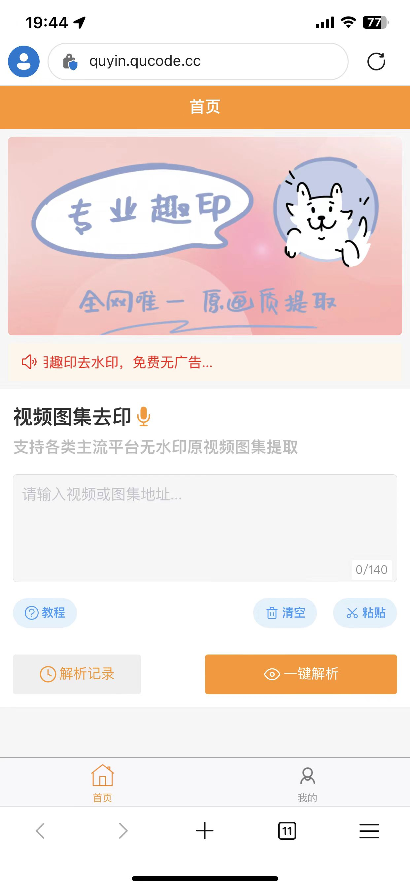
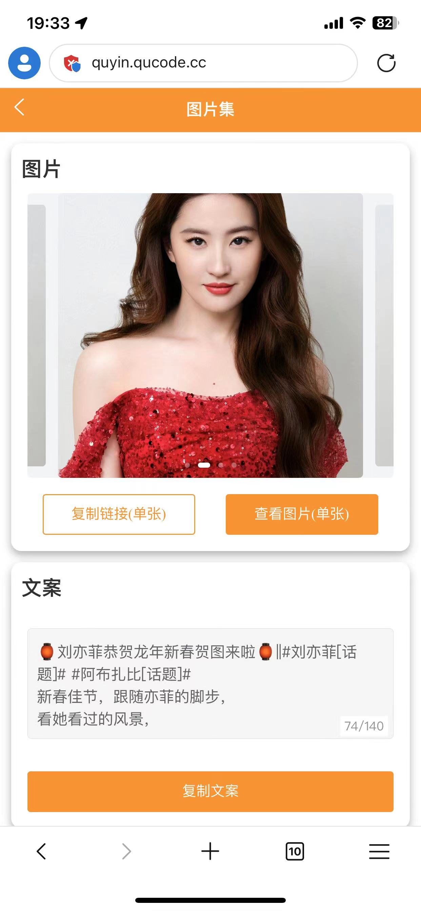
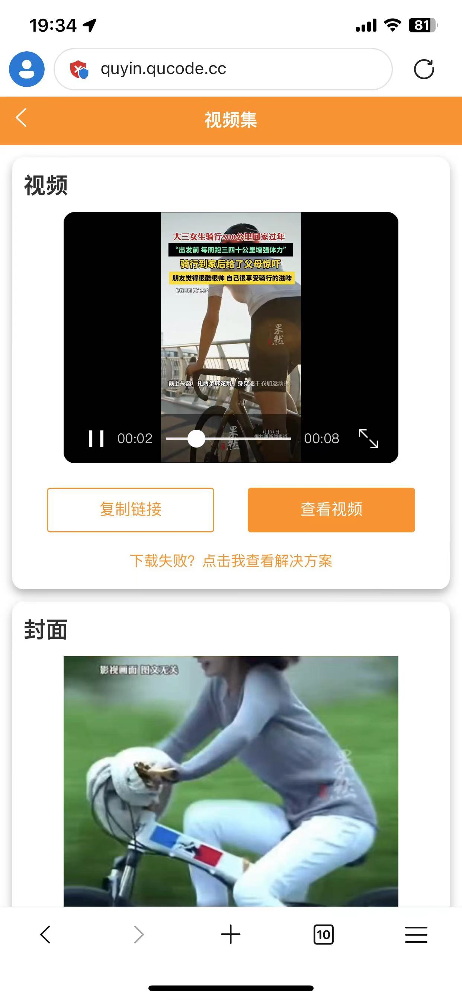
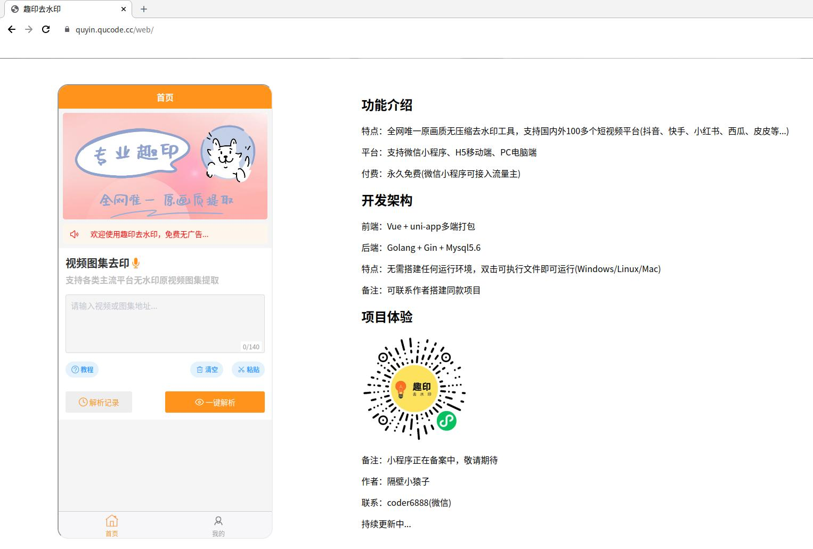

# 趣印去水印


### 功能介绍
特点：全网唯一原画质无压缩去水印工具，支持国内外100多个短视频平台(抖音、快手、小红书、西瓜、皮皮等...)

平台：支持微信小程序、H5移动端、PC电脑端

付费：永久免费(微信小程序可接入流量主)

移动端：https://quyin.qucode.cc/h5
<div>  
  


</div>

PC端：https://quyin.qucode.cc/web

<div>  

</div>

- - -
### 开发架构
前端：Vue + uni-app多端打包

后端：Golang + Gin + Mysql5.6

特点：无需搭建任何运行环境，双击可执行文件即可运行(Windows/Linux/Mac)

- - -
#### 本地部署
第一步：复制config.yaml.example到config.yaml

第二步：修改配置文件config.yaml，填写正确mysql链接地址

第三步：运行./quyin-linux-amd64-x86_64
```
Linux：运行./quyin-linux-amd64-x86_64

Windows：双击quyin-windows-x64.exe

其他操作系统：联系作者编译出包
```
- - -
#### Nginx部署
```
server {
    listen        80;
    server_name  xxx.com;
    
    # 自动跳转web端
    location = / {
       rewrite ^ https://$server_name/web permanent;
    }

    # 防盗出现403
    add_header Referrer-Policy "no-referrer" always;
    
    location ~ ^/(api|web|h5) {
        proxy_pass http://127.0.0.1:7800;  #代理指向的api接口地址
    }
}
```
- - -
